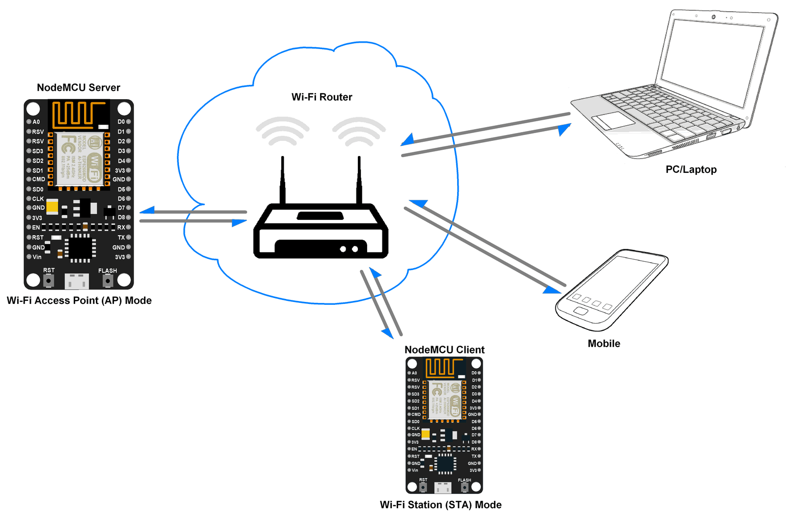
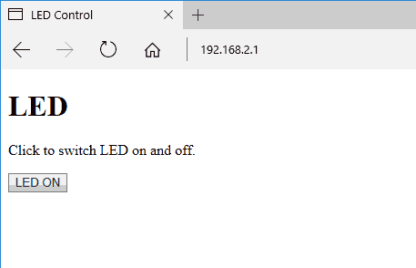

# Introduction

The Hypertext Transfer Protocol (HTTP) is standard application layer protocol which functions as a request response protocol in between server and client.

It is widely used in IoT (Internet of Things) embedded applications, where every sensor is connected to a server and we have access to control them over the internet.

NodeMCU has Wi-Fi functionality available on board. With this Wi-Fi functionality NodeMCU can connect to any wi-fi network as client or it can create a network to which other wi-fi enabled devices can connect.

# NodeMCU as HTTP Server using Wi-Fi AP mode
NodeMCU wi-fi has Access Point (AP) mode through which it can create Wireless LAN to which any wi-fi enabled device can connect as shown in below figure.

We can set SSID and Password for AP mode which will be used to authenticate other devices while connecting to it.

# NodeMCU as HTTP Server using Wi-Fi STA mode
NodeMCU has Station (STA) mode using which it can connect to existing wi-fi network and can act as HTTP server with IP address assigned by that network.

NodeMCU gets IP from Wi-Fi router to which it is connected. With this IP address, it can act as an HTTP server to which any wi-fi device can connect.

# Example
## HTML page for client
As we are making HTTP server for LED on/off functionality, we are going to make simple HTML page which will be visible at client side and able to take user input for LED on/off. It is user friendly representation of button input which takes input from user on click.

We need to write two HTML pages for LED ON and LED OFF state i.e. when client clicks the LED ON button, then in next action we need to provide option for LED OFF. Below are the two HTML code snippets for LED ON and LED OFF state presentation.

e.g. `window.location.href='/ledon'` will redirect the current page to the URL `current_url/ledon` page. If current location is `http://192.168.0.1` then it will redirect to `http://192.168.0.1/ledon` page. Page redirect action is taken on click event (e.g. click on button).  

Here we are using above mentioned concept (page redirect) to redirect the client from LED ON page to LED OFF page and vice versa

Now we can send above HTML snippets when client connects to the server and also when client clicks on button.

## Program
In Wi-Fi Access Point (AP) mode, NodeMCU creates server hence we can set its IP address, IP subnet mask and IP gateway.

Let’s take below SSID, Password to join network and addresses for AP mode

- SSID = “NodeMCU”
- Password = “12345678”
- IP = "192.168.2.1"
- Sub netmask = "255.255.255.0"
- Gateway = "192.168.2.1"

**Note:** After successful uploading of above sketch client needs to connect to the network created by NodeMCU first.

After connecting to NodeMCU network from wifi enter the server address in browser i.e. `http://server_ip_address` e.g. in our case it is `http://192.168.2.1`. After press Enter key we can see the HTML page response from server as shown in below image. Now just click the button to change the state of LED.

Now, let’s do the HTTP server to NodeMCU using Wi-Fi station mode.

In Wi-Fi Station (STA) mode, NodeMCU gets IP addresses from Wi-Fi router (access point). If we are also in same network then we can directly connect to NodeMCU HTTP Server using IP address only.

**Note:** in wi-fi station mode we need to enter the ssid and password of existing network. After connecting to WiFi network enter the server address in browser i.e. http://assigned_ip_address. After pressing Enter key we can see the HTML page response from server in the browser as shown above for AP mode.